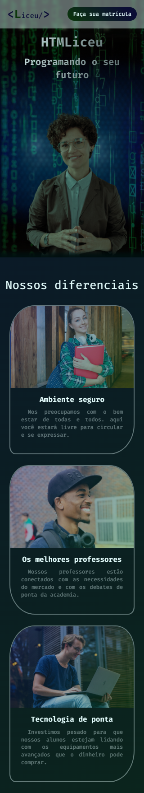
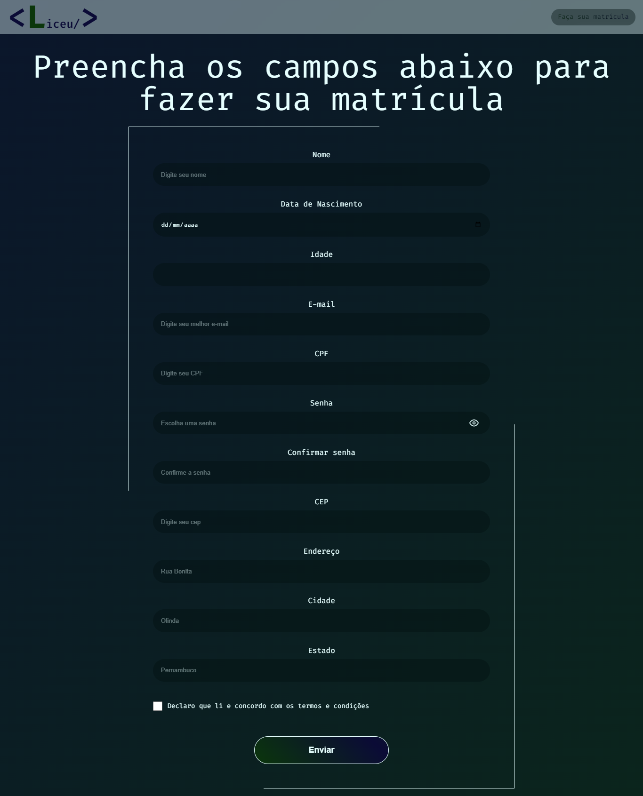
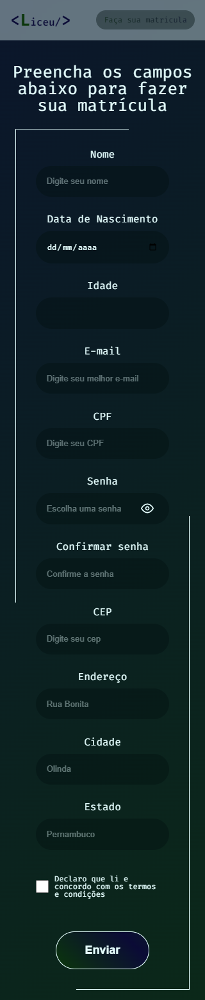

# HTMLiceu - Technology school

### Highlights:
* :eye_speech_bubble: Built with mobile-first technique
* :mage: Fluid typography
* :art: Form validation using HTML and JavaScript
* :gear: Three-layer-background
* :sth: Hide/show password with icon change 
* :sth: Scrollbar styling

### Still to come:
* :eye_speech_bubble: Automatic age fill
* :mage: Fetch adress through CEP
* :art: CPF validation
* :gear: Parallax effect on background

### Tecnologies used:

* HTML
* CSS
* Javascript

### How to open:

Access: https://marcelluscaio.github.io/HTMLiceu/